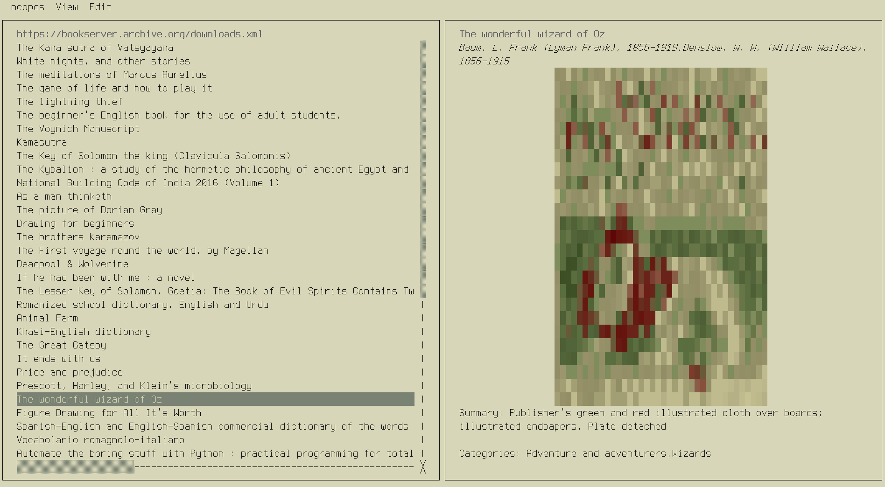

# ncopds 
`ncopds` is a TUI program for navigating OPDS directories, written in Rust with [cursive](https://github.com/gyscos/cursive). By setting up a configuration file, any number of OPDS directories can be visited. From the main interface, users can get a preview of the books available on the catalog and download them directly to a directory of their choice. OPDS search is also supported.

<p align="center">
    
</p>

The interface is designed to be responsive, using multiple threads to manage the data coming in from the OPDS server and drive the UI. Locally, `ncopds` allows users to manage their downloads directory through a set of basic operations, allowing them to rename and delete files. Downloaded books are opened using your system's preferred handler for .pdfs / .epubs. `ncopds` does not store metadatain sqlite databases or clutter up your downloads directory in any way, unlike other ebook managers. 

Servers requiring authentication are supported. `ncopds` does not store your passwords anywhere. Instead, it relies on your system's keyring to store passwords.

**This is still alpha software. Please feel free to submit bugs using the issue tracker and improve upon what you see here.**

You can find a directory of OPDS catalogs you can use with `ncopds` [here](https://wiki.mobileread.com/wiki/OPDS). I personally run a `calibre-web` server which supports serving books through a OPDS catalog; that directory has other software you can use to serve OPDS catalogs as well.

# Installation
The easiest way to install `ncopds` is through Rust's package manager, `cargo`. Just run `cargo install ncopds` to get started! Currently, only linux is supported. I cannot guarantee it will work on MacOS or Windows.

# Using ncopds
There are several menus at the top of the screen. Clicking `ncopds` at the top of the screen shows you a help menu with information similar to this README.

`View` allows you to add / change connections to OPDS catalogs. When you add a new connection to `ncopds`, it will appear at the bottom of the `View` menu. Clicking it will render the contents of that catalog in the main view which you can then browse and download to your heart's content.

`Edit` lets you change information about a connection, including its name, URL and login credentials. These features are alternatives to directly editing the config file that is located at `$HOME/.config/ncopds/config.toml`.

# Configuration
The only field that is required for `ncopds` to work is the `download_directory` field. If you want to add a connection manually, you can write them in this way:
```
[servers.{NICKNAME_FOR_YOUR_SERVER}]
base_url = "https://example.com/opds" (MUST BE FIRST OPDS PAGE, NOT JUST THE DOMAIN)
username = "rostyhn" (OPTIONAL)
```
You cannot store a password inside the configuration file. If you include a username inside a connection, `ncopds` will ask you for the password the next time you run it.

## Configuring the theme 
You can also edit the cursive theme by editing the theme file located at `$HOME/.config/ncopds/theme.toml`. More documentation on the options is available [here](https://docs.rs/cursive/latest/cursive/theme/index.html). Otherwise, `ncopds` will just use your default terminal colors.

# Hotkeys
There are some hotkeys available.
| Key | Action | Context |
| --- | ------ | ------- |
| o   | Opens a file | Only when viewing local directory |
| d   | Deletes a file | Only when viewing local directory |
| r   | Renames a file | Only when viewing local directory |
| /   | Search catalog | Both online and in local directories; only if online directory supports it |
| ?   | Open help screen | Anywhere |

# Project TODO
- [ ] Support all [OPDS acquisition types](https://opds-spec.org/2011/06/19/understanding-acquisition-links/)
- [ ] Make search async
- [ ] Achieve reasonable test coverage
- [ ] Provide more metadata when browsing locally without resorting to storing additional information
- [ ] Support for windows / mac
- [ ] Improve book rendering
